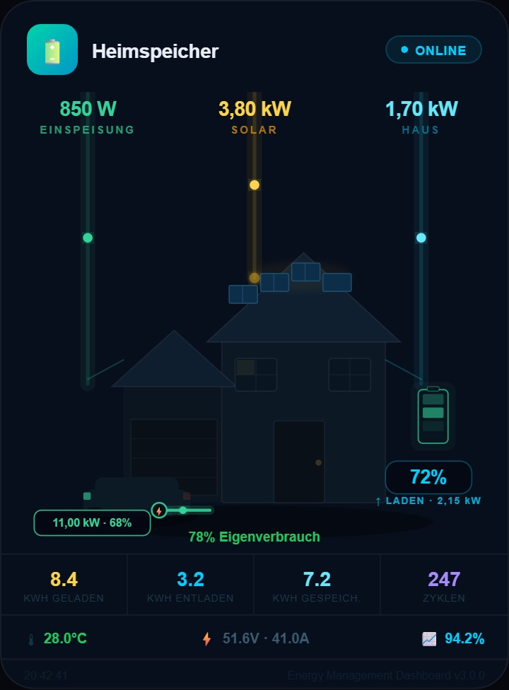
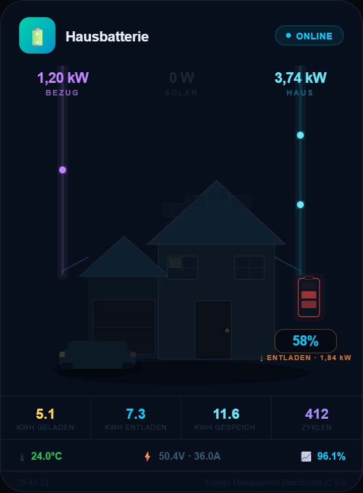
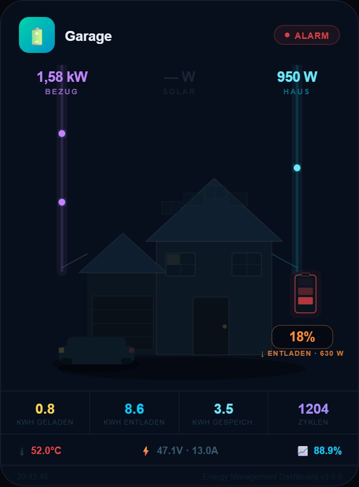

# Energy Management Dashboard

**Premium Lovelace Dashboard-Karte für Batteriespeicher in Home Assistant**

[](https://hacs.xyz)
[](https://github.com/buggel1009/Energy-Managament-Dashboard/releases)
[](https://www.home-assistant.io)

---

## Vorschau

<p align="center">
  
</p>
<p align="center"><sub><b>⚡ Laden (Batterie pulsiert grün) · ☀ Solar · 🚗 E-Auto lädt · Einspeisung</b></sub></p>

<p align="center">
  
  &nbsp;&nbsp;
  
</p>
<p align="center">
  <sub><b>🔋 Entladen (pulsiert rot) · Netzbezug</b></sub>
  &nbsp;&nbsp;&nbsp;&nbsp;&nbsp;&nbsp;&nbsp;&nbsp;&nbsp;&nbsp;&nbsp;&nbsp;&nbsp;&nbsp;&nbsp;&nbsp;&nbsp;&nbsp;&nbsp;&nbsp;&nbsp;&nbsp;&nbsp;&nbsp;
  <sub><b>⚠ Alarm · niedriger SOC · Übertemperatur</b></sub>
</p>

---

## Unterstützte Systeme

| Hersteller | Modelle |
|------------|---------|
| **Marstek** | Venus E v1/v2/v3, Venus A, Venus D |
| **Victron** | MultiPlus-II, EasySolar, MPII |
| **Sungrow** | SBR096 – SBR256, SBH |
| **Fronius** | Symo GEN24, BYD HVM/HVS |
| **Huawei** | LUNA2000 |
| **Fox ESS** | T-Series, ECS |
| **Andere** | Alle Speicher mit HA-Integration |

---

## Installation via HACS

1. **HACS** → *Frontend* → ⋮ → *Benutzerdefinierte Repositories*
2. URL eintragen: `https://github.com/buggel1009/Energy-Managament-Dashboard`
3. Kategorie: **Lovelace**
4. Installieren → Home Assistant neu laden

### Manuelle Installation

Datei `energy-management-dashboard.js` in den Ordner `/config/www/` kopieren und als Lovelace-Ressource einbinden:

```yaml
# configuration.yaml oder Lovelace-Ressourcen
resources:
  - url: /local/energy-management-dashboard.js
    type: module
```

---

## Karte einrichten

```yaml
type: custom:energy-management-dashboard
title: Heimspeicher
entity_prefix: marstek_venus_1   # → generiert Kopiervorlage im Editor
show_health: true
show_energy_stats: true
entities:
  # ── Pflicht ──
  battery_soc: sensor.marstek_venus_1_battery_soc
  battery_power: sensor.marstek_venus_1_battery_power
  # ── Energiefluss (Haus-Visualisierung) ──
  home_consumption: sensor.haus_gesamtverbrauch        # Haus-Strang (cyan)
  grid_power: sensor.netz_leistung                     # + = Bezug, − = Einspeisung
  mppt1_power: sensor.marstek_venus_1_mppt1_power       # Solar-Strang (gelb)
  # ── E-Auto / Wallbox (optional) ──
  ev_charge_power: sensor.wallbox_ladeleistung         # W — lädt → grünes Kabel
  ev_soc: sensor.auto_akku_soc                         # %
  ev_connected: binary_sensor.wallbox_verbunden        # on/off
  # ── Detail-Werte ──
  internal_temperature: sensor.marstek_venus_1_internal_temperature
  battery_voltage: sensor.marstek_venus_1_battery_voltage
  battery_current: sensor.marstek_venus_1_battery_current
  total_daily_charging_energy: sensor.marstek_venus_1_total_daily_charging_energy
  total_daily_discharging_energy: sensor.marstek_venus_1_total_daily_discharging_energy
  stored_energy: sensor.marstek_venus_1_stored_energy
  battery_cycle_count_calc: sensor.marstek_venus_1_battery_cycle_count_calc
  round_trip_efficiency_total: sensor.marstek_venus_1_round_trip_efficiency_total
  max_cell_voltage: sensor.marstek_venus_1_max_cell_voltage
  min_cell_voltage: sensor.marstek_venus_1_min_cell_voltage
  fault_status: sensor.marstek_venus_1_fault_status
  alarm_status: sensor.marstek_venus_1_alarm_status
  wifi_status: binary_sensor.marstek_venus_1_wifi_status
```

> **Tipp:** Im visuellen Editor einfach den `entity_prefix` (z.B. `marstek_venus_1`) eingeben — die Karte generiert dann automatisch eine vollständige Kopiervorlage mit allen Entity-IDs.

---

## Features

| Feature | Beschreibung |
|---------|-------------|
| 🏠 **Haus-Visualisierung** | Realistisches Haus mit farbigen Energie-Strängen (Netz · Solar · Haus) |
| 🔋 **Pulsierende Batterie** | Speicher leuchtet **grün beim Laden**, **rot beim Entladen** — Füllbalken-Welle |
| 🌊 **Animierter Fluss** | Partikel auf jedem Strang, Geschwindigkeit proportional zur Leistung |
| 🚗 **E-Auto / Wallbox** | Ladekabel + Badge mit Leistung & Akku-SOC, animiert beim Laden |
| ⚡ **Netzrichtung** | Bezug (lila) ↔ Einspeisung (grün) automatisch erkannt |
| 📊 **Tagesstatistik** | kWh geladen, entladen, gespeichert, Zyklen |
| 🌡️ **Detail-Werte** | Temperatur, Spannung/Strom, Effizienz, Zell-Delta |
| 👆 **Klickbar** | Jeder Wert öffnet den HA-Verlauf (More-Info) der Entität |
| 🔔 **Alarm** | Blinkender Alarm-Chip bei Fehlern |
| 🏭 **Multi-Hersteller** | Icon-Farbe passt sich automatisch dem Gerät an |
| 🌑 **Dark Mode** | Natives Dark-Theme, reine Lese-/Monitoring-Ansicht |

---

## Konfigurationsoptionen

| Option | Typ | Standard | Beschreibung |
|--------|-----|----------|--------------|
| `title` | string | `Heimspeicher` | Anzeigename der Karte |
| `entity_prefix` | string | — | Geräteprefix für Kopiervorlage im Editor |
| `show_health` | bool | `true` | Detaildaten (Temp, Spannung, Effizienz) anzeigen |
| `show_energy_stats` | bool | `true` | Tagesstatistik-Reihe anzeigen |

---

## Changelog

Alle Änderungen sind in der [CHANGELOG.md](CHANGELOG.md) dokumentiert.
Bei einem Update zeigt HACS automatisch die Versionshinweise des jeweiligen
GitHub-Releases an.

> **Für Maintainer:** Damit die Änderungen im HACS-Update-Dialog erscheinen,
> beim Taggen eines Releases (`1.0.0`, `1.1.0`, …) den passenden Abschnitt aus
> der `CHANGELOG.md` in die **GitHub-Release-Beschreibung** kopieren.

---

## Lizenz

MIT License — frei verwendbar, auch für kommerzielle Projekte.

---

*Energy Management Dashboard v1.0.0 · Premium Design für Home Assistant*
